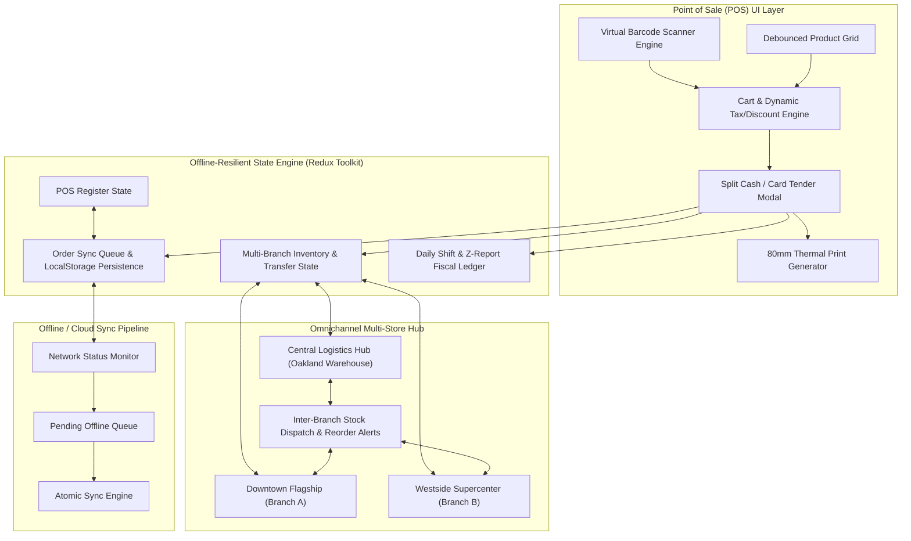

# Retail POS & Multi-Store Inventory Management System

[](https://www.typescriptlang.org/)
[](https://react.dev/)
[](https://redux-toolkit.js.org/)
[](https://tailwindcss.com/)
[](https://www.docker.com/)

A high-performance, offline-resilient **Point of Sale (POS) and Enterprise Multi-Branch Inventory Management Platform** engineered with React 18, TypeScript, Redux Toolkit, and Tailwind CSS. Built to handle omnichannel retail operations with virtual barcode scanning, real-time inventory synchronization across multi-store locations, split tender processing, 80mm thermal receipt printing, and daily fiscal Z-report cash reconciliation.

---

## 🏛 System Architecture



---

## 🚀 Key Functional Modules

### 1. High-Speed POS Register & Barcode Engine
- **Keyboard-Driven Barcode Scanner**: Hotkey capture (`F2` or `/`), instant autofocus, audio feedback via Web Audio API synthesis, and simulated barcode quick-pick tags.
- **Fast Product Lookup**: Debounced multi-field search across FMCG categories, SKUs, and barcodes.
- **Dynamic Calculation Engine**: Tiered line-item discounts, basket-level coupons, and automated sales tax (configurable per product class).
- **Split Tender Checkout**: Simultaneous Cash + Card split payments with real-time change calculation and EMV terminal authorization code simulation.
- **80mm Thermal Receipt Preview**: Native `@media print` CSS formatted for 80mm thermal receipt roll printers, plain-text export, and transaction re-prints.

### 2. Offline-First Resilience (Redux Toolkit + LocalStorage)
- **Zero-Downtime Guarantee**: Cashiers can scan and complete transactions even during total network disconnections.
- **Background Sync Queue**: Offline checkouts are stamped with `pending_sync` status and held in a persistent FIFO queue.
- **Automated Reconnect Sync**: As soon as connection is restored, transactions sync atomically with the central ledger.

### 3. Multi-Store Inventory & Safety Stock Alerts
- **Branch-Level Stock Matrix**: View and manage live quantities across **Downtown Flagship**, **Westside Supercenter**, and **Central Logistics Hub**.
- **Automated Safety Threshold Alerts**: Real-time visual warnings when stock levels breach minimum safety buffers.
- **Inter-Branch Stock Transfers**: Formal workflow to request, dispatch (`in_transit`), and receive replenishment goods between central warehouse and stores.
- **In-Place Stock Audit**: Instant adjustments for physical inventory counts with audit trail notes.

### 4. Daily Shift Closing & Z-Report Reconciliation
- **Opening Float Tracking**: Register drawer float initialization per cashier shift.
- **Mid-Shift Cash Drops**: Secure transfer of excess drawer cash to the back-office drop safe.
- **Drawer Balancing Formula**:
  $$\text{Expected Cash} = \text{Opening Float} + \text{Cash Sales} - \text{Cash Drops}$$
- **Discrepancy Auditing**: Automatic comparison against actual physical cash counts (Over/Short detection).
- **Export & Print**: One-click CSV export and printable formal fiscal Z-report document.

### 5. Multi-Store Business Intelligence & Analytics
- Gross Revenue, Average Basket Size, Units Sold, and Unrealized Inventory Capital Margin.
- Store-by-store sales comparison with visual progress metrics.
- Top-performing FMCG product rankings and tender share distribution.

---

## 📦 FMCG Seed Catalog

Includes **30+ realistic Fast-Moving Consumer Goods (FMCG)** with barcode numbers, SKUs, wholesale cost prices, and retail prices across:
- **Beverages** (Cold brew coffee, peach green tea, alkaline water, oat milk, kombucha)
- **Snacks & Confectionery** (Avocado chips, trail mix, protein bars, sour gummies, sourdough crackers)
- **Dairy & Fresh** (Greek yogurt, aged cheddar, French salted butter, organic eggs, buffalo mozzarella)
- **Bakery & Deli** (Country sourdough, butter croissants, NYC bagels, blueberry muffins)
- **Pantry & Staples** (Extra virgin olive oil, bronze-cut tagliatelle, San Marzano tomatoes, raw honey)
- **Personal Care & Household** (Botanical body wash, bamboo toothbrushes, dish soap, surface spray)

---

## 🛠 Technology Stack

| Layer | Technologies |
| :--- | :--- |
| **Frontend Framework** | React 18 (TypeScript) |
| **State Management** | Redux Toolkit (`@reduxjs/toolkit`, `react-redux`) |
| **Styling & Design System** | Tailwind CSS v4, Lucide Icons |
| **Audio Feedback** | Native Web Audio API Sound Synthesizer |
| **Printing & Thermal Output** | CSS `@media print` 80mm Layout |
| **Build & Tooling** | Vite 6, TypeScript 5.7 |
| **Containerization** | Docker, Docker Compose (Multi-stage build) |

---

## 🏃 Getting Started

### Prerequisites
- Node.js `20.x` or `22.x`
- npm `10.x`+

### 1. Clone & Install
```bash
git clone https://github.com/trung0017/Retail-POS-Multi-Store-Inventory-Management-System.git
cd Retail-POS-Multi-Store-Inventory-Management-System
npm install
```

### 2. Run Local Development Server
```bash
npm run dev
```
Open [http://localhost:3000](http://localhost:3000) in your browser.

### 3. Production Build
```bash
npm run build
npm run preview
```

---

## 🐳 Docker Deployment

Run the complete production container with 1 command:
```bash
docker compose up -d --build
```
Access the application on port `3000`.

---

## 📋 Hotkeys & Shortcuts

| Hotkey | Action |
| :--- | :--- |
| `F2` or `/` | Focus Barcode / SKU Scanner input |
| `Enter` | Submit scanned barcode to register cart |
| `Space` | Quick focus to payment checkout |

---

## 📄 License
MIT © 2026 [Thanh Trung](https://github.com/trung0017)
